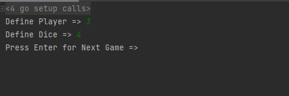
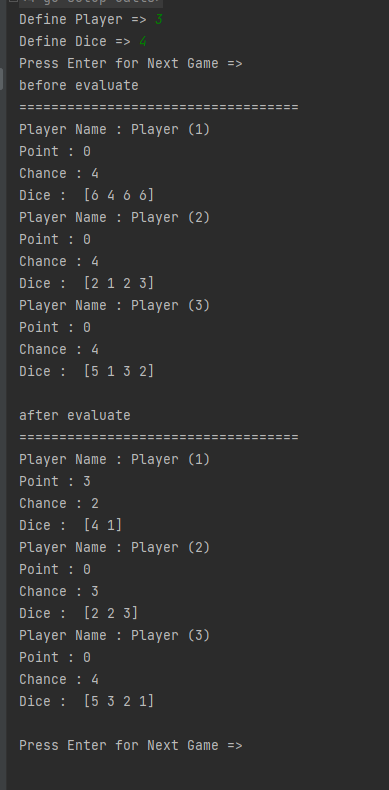
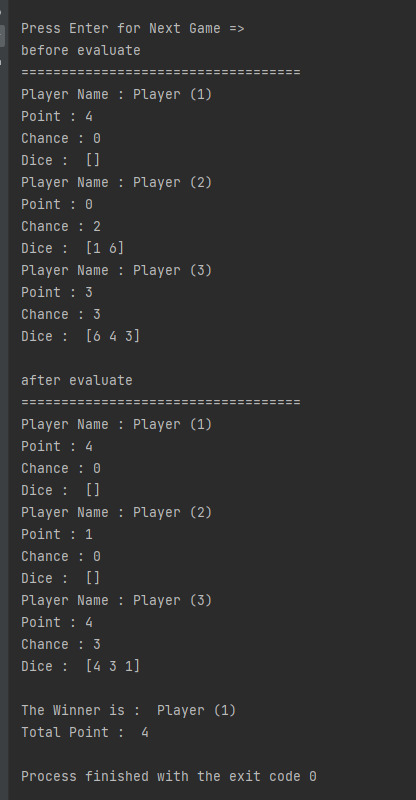

# dicegame
project ini hanya untuk menyelesaikan technical test dari pt arta graha

bagaimana cara menjalankan program :

untuk membuild aplikasi gunakan syntax : go build ./

jika process build sudah selesai lalu lanjut utuk menjalankan program

untuk menjalankan aplikasi gunakan : go run ./

jika program berhasil di running 
maka tampilan nya sebagai berikut :

ayo kita mulai :D

pertama define terlebih dahulu mau berapa player yang akan ikut bermain

saya ambil contoh 3 

dan define terlebih dahulu mau berapa dadu nya

saya ambil contoh 4 juga

lalu klik ENTER 

jika sudah maka hasil nya akan seperti berikut 

terus klik enter sampai pemenang di ketahui

jika pemenang sudah di ketahui maka game akan berakhir

tara pemenang nya adalah player 1 dengan total point 4

meskipun player 3 point nya 4 juga tetapi yang duluan habis adalah player 1

